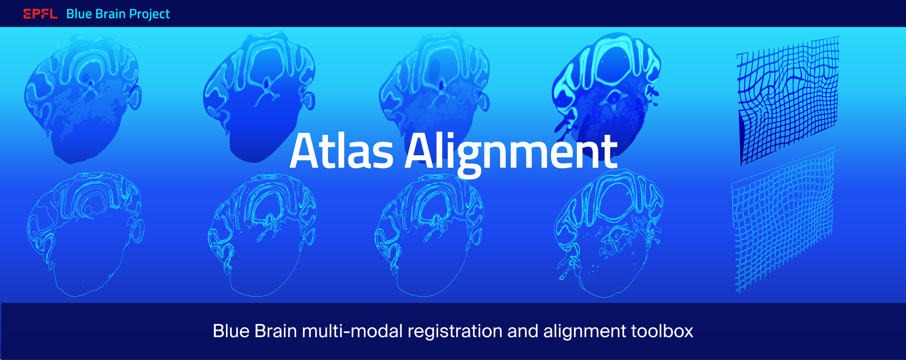

# Atlas Alignment

<table>
<tr>
  <td>Latest Release</td>
  <td>
    <a href="https://github.com/BlueBrain/atlas_alignment/releases">
    
    </a>
  </td>
</tr>
<tr>
  <td>License</td>
  <td>
    <a href="https://github.com/BlueBrain/atlas_alignment/blob/master/LICENSE.md">
    
    </a>
</td>
</tr>
<tr>
  <td>Build Status</td>
  <td>
    <a href="https://travis-ci.com/BlueBrain/atlas_alignment">
    
    </a>
  </td>
</tr>
<tr>
	<td>Code Style</td>
	<td>
		<a href="https://github.com/psf/black">
		
		</a>
		<a href="https://pycqa.github.io/isort/">
		
		</a>
		<a href="http://www.pydocstyle.org/">
		
		</a>
		<a href="https://flake8.pycqa.org/">
		
		</a>
	</td>
</tr>
</table>

Atlas Alignment is a toolbox to perform multimodal image registration. It 
includes both traditional and supervised deep learning models. 

This project originated from the Blue Brain Project efforts on aligning mouse 
brain atlases obtained with ISH gene expression and Nissl stains. 


### Official documentation
All details related to installation and logic are described in the 
[official documentation](https://atlas-alignment.readthedocs.io/).


### Installation

#### Installation Requirements

Some of the functionalities of `atlalign` depend on the [TensorFlow implementation
of the Learned Perceptual Image Patch Similarity (LPIPS)](https://github.com/alexlee-gk/lpips-tensorflow). Unfortunately, the
package is not available on PyPI and must be installed manually as follows.
```shell script
pip install git+http://github.com/alexlee-gk/lpips-tensorflow.git#egg=lpips_tf
```

You can now move on to installing the actual `atlalign` package!

#### Installation from PyPI
The `atlalign` package can be easily installed from PyPI.
```shell script
pip install atlalign
```

#### Installation from source
As an alternative to installing from PyPI, if you want to try the latest version
you can also install from source. 
```shell script
pip install git+https://github.com/BlueBrain/atlas_alignment#egg=atlalign
```

#### Installation for development
If you want a dev install, you should install the latest version from source with
all the extra requirements for running test and generating docs. 
```shell script
git clone https://github.com/BlueBrain/atlas_alignment
cd atlas_alignment
pip install -e .[dev,docs]
```

### Examples
You can find multiple examples in the documentation. Specifically, make
sure to read the 
[Building Blocks](https://atlas-alignment.readthedocs.io/en/latest/source/building_blocks.html) 
section of the docs to understand the basics.


### Funding & Acknowledgment
This project was supported by funding to the Blue Brain 
Project, a research center of the Ecole polytechnique fédérale de Lausanne, from 
the Swiss government's ETH Board of the Swiss Federal Institutes of Technology.

COPYRIGHT 2021, Blue Brain Project/EPFL
