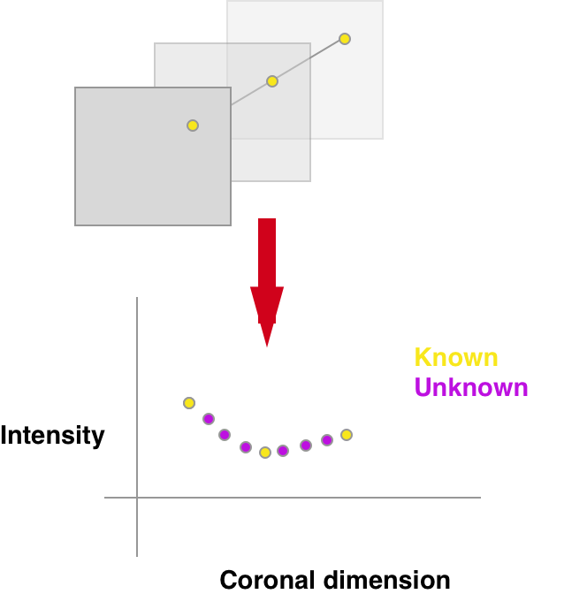

3D Interpolation
================
Once we register consecutive 2D slices the next step is to think of creating 3D volumes. This is especially relevant
for data from the **Allen Brain Institute** that come from experiments with a very specific design (see  :ref:`allen`).

There are multiple ways how to perform this interpolation and some of these are contained in the :code:`atlalign.volume`
module:

- :code:`CoronalInterpolator`

CoronalInterpolator
-------------------
The :code:`CoronalInterpolator` turns the entire problem into a 1D function interpolation. See below the sketch:

For each pixel separately one interpolates over missing sections based purely on the corresponding pixels in all
of the existing sections.

.. testcode::

    import numpy as np

    from atlalign.volume import CoronalInterpolator, GappedVolume

    n_sections = 55
    shape = (30, 40)

    sn = np.random.choice(np.arange(527), size=n_sections, replace=False)
    imgs = np.random.random((n_sections, *shape))

    gv = GappedVolume(sn, imgs)
    ci = CoronalInterpolator()

    final_volume = ci.interpolate(gv)
    print(final_volume.shape)  # (528, shape[0], shape[1])

.. testoutput::
   :hide:
   :options: -ELLIPSIS, +NORMALIZE_WHITESPACE

   (528, 30, 40)
