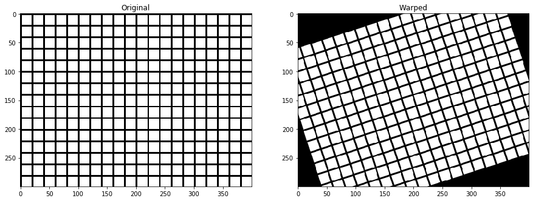
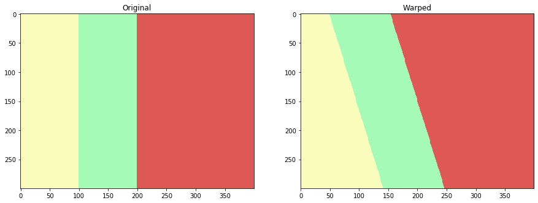
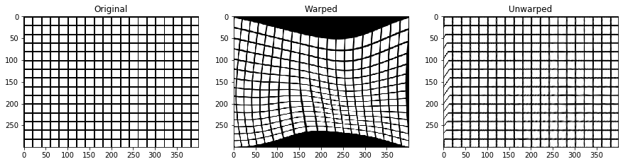
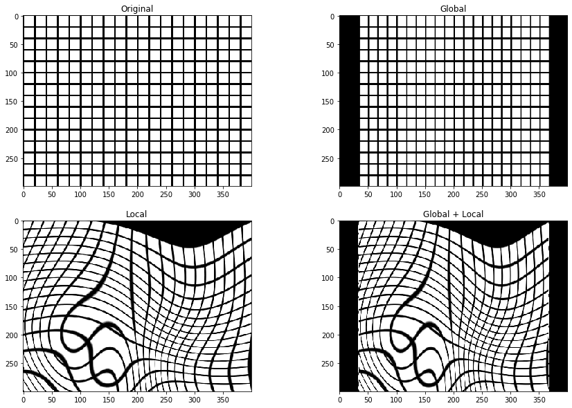
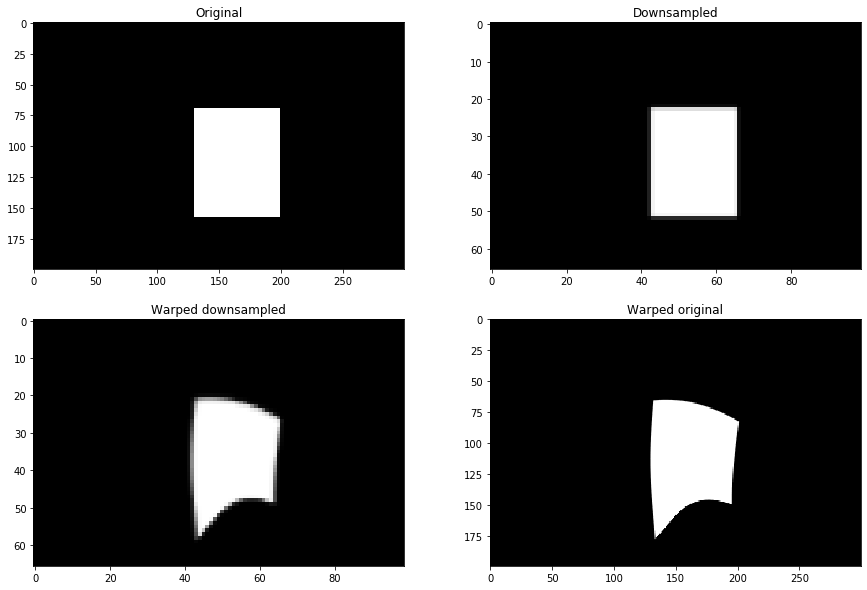
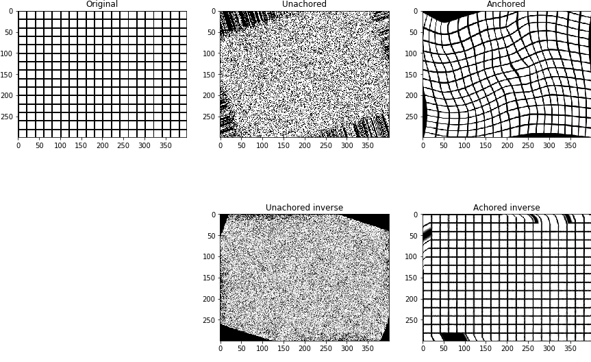

.. _building_blocks:

===============
Building Blocks
===============

Displacement field
==================
The geometric transformation can be captured by a so called **displacement field**. It specifies pixel by pixel
correspondence between the reference and moving space.

Within the package, the corresponding class is :code:`atlalign.base.DisplacementField`. To instantiate it
one has two options

1. Provide :code:`delta_x` and :code:`delta_y` - 2D arrays of the same shape representing the displacement in the x and y direction
2. Use the class method :code:`generate` that provides access to wide range of predefined geometric transformations.

.. testcode::

    import numpy as np

    from atlalign.base import DisplacementField

    shape = (30, 35)

    # Manual construction
    delta_x = np.zeros(shape)
    delta_y = np.zeros(shape)

    df_manual = DisplacementField(delta_x, delta_y)

    # Presets
    df_preset = DisplacementField.generate(shape, approach='identity')

    # They lead to the same result
    assert df_manual == df_preset

The :code:`DisplacementField` comes with multiple useful methods and attributes.

Image warping
=============
The main operation that one can perform with a displacement field is image warping. It corresponds
to applying a given geometric transformation to an image. The corresponding method is :code:`warp`.

.. testcode::

    import matplotlib.pyplot as plt
    import numpy as np

    from atlalign.base import DisplacementField
    from atlalign.visualization import create_grid

    shape = (300, 400)

    df =  DisplacementField.generate(shape, approach='affine_simple', rotation=np.pi / 10)
    img = create_grid(shape)
    img_warped = df.warp(img)

    fig, (ax_1, ax_2) = plt.subplots(1, 2, figsize=(15, 10))
    ax_1.imshow(img, cmap='gray')
    ax_1.set_title('Original')
    ax_2.imshow(img_warped, cmap='gray')
    ax_2.set_title('Warped')

Annotation warping
==================
Annotation warping can be used on segmentation/annotation images where each pixel represents a class rather
than an intensity. The reason why image and annotation warping are separated is that different interpolation schemes
are necessary. The corresponding method is :code:`warp_annotation`.

.. testcode::

    import matplotlib.pyplot as plt
    import numpy as np

    from atlalign.base import DisplacementField
    from atlalign.visualization import create_segmentation_image

    shape = (300, 400)

    annot = np.zeros(shape, dtype='int32')
    annot[:, :100] = 1
    annot[:, 100:200] = 321
    annot[:, 200:] = 113

    df = DisplacementField.generate(shape, approach='affine_simple', rotation=0.3)

    warped_annot = df.warp_annotation(annot)

    annot_img, colors_dict = create_segmentation_image(annot)
    warped_annot_img = create_segmentation_image(warped_annot, colors_dict=colors_dict)[0]

    assert set(np.unique(annot)) == set(np.unique(warped_annot))

    fig, (ax_1, ax_2) = plt.subplots(1, 2, figsize=(15, 10))
    ax_1.imshow(annot_img)
    ax_1.set_title('Original')
    ax_2.imshow(warped_annot_img)
    ax_2.set_title('Warped')

Inversion
=========
Once given a displacement field we can find its inverse (numerically). Note that inversion is a necessary operation when
creating artificial augmentations. If we warp an image with a given displacement field, we need to also know the way
how to undo it. The corresponding method is :code:`pseudo_inverse`.

.. testcode::

    import matplotlib.pyplot as plt
    import numpy as np

    from atlalign.base import DisplacementField
    from atlalign.visualization import create_grid

    shape = (300, 400)
    edge_mask = np.zeros(shape, dtype=bool)
    edge_mask[200:250, 100:300] = True

    df =  DisplacementField.generate(shape,
                                     approach='edge_stretching',
                                     edge_mask=edge_mask,
                                     n_perturbation_points=4,
                                     radius_max=20,
                                     interpolation_method='rbf')
    df_inv = df.pseudo_inverse()

    img = create_grid(shape)
    img_warped = df.warp(img)
    img_unwarped = df_inv.warp(img_warped)

    fig, (ax_1, ax_2, ax_3) = plt.subplots(1, 3, figsize=(15, 10))
    ax_1.imshow(img, cmap='gray')
    ax_1.set_title('Original')
    ax_2.imshow(img_warped, cmap='gray')
    ax_2.set_title('Warped')
    ax_3.imshow(img_unwarped, cmap='gray')
    ax_3.set_title('Unwarped')

Composition
===========
For more sophisticated augmentations it is useful combine multiple different transformations. This corresponds
to composition of displacement fields. The corresponding method is :code:`__call__`.

.. testcode::

    import matplotlib.pyplot as plt
    import numpy as np

    from atlalign.base import DisplacementField
    from atlalign.visualization import create_grid

    shape = (300, 400)
    edge_mask = np.zeros(shape, dtype=bool)
    edge_mask[200:250, 100:300] = True

    df_g = DisplacementField.generate(shape, approach='affine_simple', scale_x=1.2)

    df_l = DisplacementField.generate(shape,
                                     approach='edge_stretching',
                                     edge_mask=edge_mask,
                                     n_perturbation_points=5,
                                     radius_max=50,
                                     interpolation_method='rbf')

    df_gl = df_l(df_g)

    img = create_grid(shape)
    img_warped_g = df_g.warp(img)
    img_warped_l = df_l.warp(img)
    img_warped_gl = df_gl.warp(img)

    fig, ((ax_1, ax_2), (ax_3, ax_4)) = plt.subplots(2, 2, figsize=(15, 10))

    ax_1.imshow(img, cmap='gray')
    ax_1.set_title('Original')

    ax_2.imshow(img_warped_g, cmap='gray')
    ax_2.set_title('Global')

    ax_3.imshow(img_warped_l, cmap='gray')
    ax_3.set_title('Local')

    ax_4.imshow(img_warped_gl, cmap='gray')
    ax_4.set_title('Global + Local')

Resizing
========
For performance purposes it might beneficial to downsample the moving image and then perform registration. Once it is
done one can resize the displacement field and warp the original image to get higher resolution images. Note that this
trick will yield superior results of simply upsampling the registered image.
The corresponding method is :code:`resize_constant`.

.. testcode::

    import matplotlib.pyplot as plt
    import numpy as np
    from skimage.draw import rectangle
    from skimage.feature import canny
    from skimage.transform import resize

    from atlalign.base import DisplacementField

    original_shape = (200, 300)
    new_shape = (66, 99)

    img_original = np.zeros(original_shape, dtype='float32')

    start = (70, 130)
    extent = (88, 70)

    rr, cc = rectangle(start, extent=extent, shape=img_original.shape)

    img_original[rr, cc] = 1
    img_new = resize(img_original, new_shape)

    edge_mask = canny(img_new)
    df =  DisplacementField.generate(new_shape,
                                     approach='edge_stretching',
                                     edge_mask=edge_mask,
                                     n_perturbation_points=5,
                                     radius_max=5,
                                     interpolation_method='rbf')

    df_resized = df.resize_constant(original_shape)

    img_new_warped = df.warp(img_new)
    img_original_warped = df_resized.warp(img_original)

    fig, ((ax_1, ax_2), (ax_3, ax_4)) = plt.subplots(2, 2, figsize=(15, 10))

    ax_1.imshow(img_original, cmap='gray')
    ax_1.set_title('Original')

    ax_2.imshow(img_new, cmap='gray')
    ax_2.set_title('Downsampled')

    ax_3.imshow(img_new_warped, cmap='gray')
    ax_3.set_title('Warped downsampled')

    ax_4.imshow(img_original_warped, cmap='gray')
    ax_4.set_title('Warped original')

Anchoring
=========
In general, the geometric transformations do not have to be well behaved. Two common problems are the following:

1. The transformation around the 4 corners of an image might not be close to an identity mapping
2. The transformations are not smooth enough

Both of the mentioned problems can result in difficulties when computing inverses numerically. To remove partially or
completely these undesirable features one can use the :code:`anchor` method.

.. testcode::

    import matplotlib.pyplot as plt
    import numpy as np

    from atlalign.base import DisplacementField
    from atlalign.visualization import create_grid

    shape = (300, 400)

    df_rotation = DisplacementField.generate(shape, approach='affine_simple', rotation=np.pi / 10)
    df_ugly= DisplacementField(np.random.randint(-20, 20, size=shape),np.random.randint(-20, 20, size=shape))

    df_unanchored = df_ugly(df_rotation)
    df_anchored = df_unanchored.anchor(smooth=0, ds_f=50)

    df_unanchored_inv = df_unanchored.pseudo_inverse()
    df_anchored_inv = df_anchored.pseudo_inverse()

    img = create_grid(shape)

    fig, ((ax_1, ax_2, ax_3), (ax_4, ax_5, ax_6)) = plt.subplots(2, 3, figsize=(15, 10))
    ax_1.imshow(img, cmap='gray')
    ax_1.set_title('Original')
    ax_2.imshow(df_unanchored.warp(img), cmap='gray')
    ax_2.set_title('Unachored')
    ax_3.imshow(df_anchored.warp(img), cmap='gray')
    ax_3.set_title('Anchored')

    ax_4.set_axis_off()
    ax_5.imshow(df_unanchored_inv.warp(df_unanchored.warp(img)),  cmap='gray')
    ax_5.set_title('Unachored inverse')
    ax_6.imshow(df_anchored_inv.warp(df_anchored.warp(img)), cmap='gray')
    ax_6.set_title('Achored inverse')

