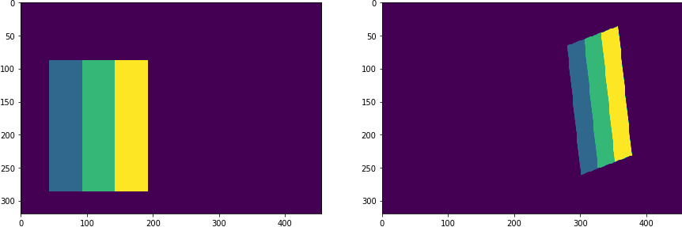
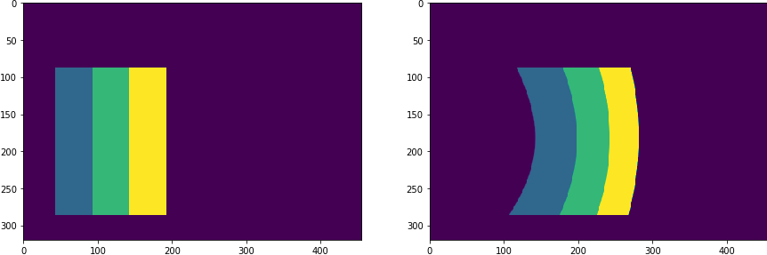
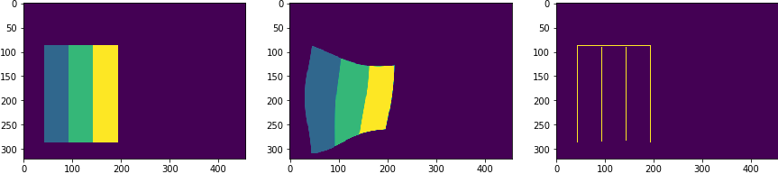
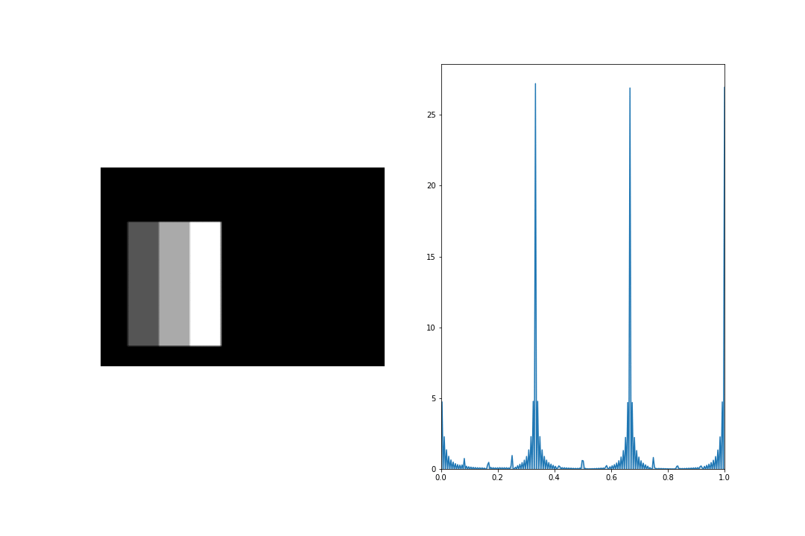
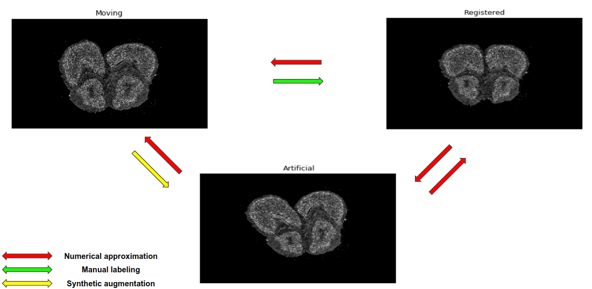
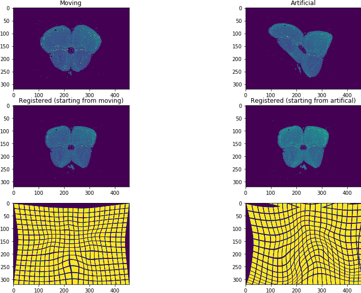

.. _dl_data:

Deep Learning - Generating a dataset
====================================
This section describes how to create a dataset for supervised learning. Note that we already described how to easily
load existing datasets in :ref:`datasets`. However, in this chapter we will discuss in detail how to perform
**augmentations** on these or similar datasets.

Augmentation is a common strategy in deep learning. The goal is to use an existing dataset and make it larger
(possibly infinitely) by altering both the inputs and the targets in some sensible way.

Generally, we will distinguish two types of augmentations

1. **Intensity** - change the pixel intensities
2. **Geometric** - change the geometric structure of the underlying image

The reason why in our use case we split augmentations into two groups is very simple : the **intensity** augmentations
do not change the labels, whereas the **geometric** ones do change our labels.

Geometric augmentations
-----------------------
The geometric augmentations are a major part of :code:`atlalign` functionality. All the augmentations can be found
in :code:`atlalign.zoo` module. They are easily accessible to the user via the :code:`generate` class method.

- :code:`affine`
- :code:`affine_simple`
- :code:`control_points`
- :code:`edge_stretching`
- :code:`projective`

Affine simple
~~~~~~~~~~~~~

.. testcode::

    import numpy as np
    import matplotlib.pyplot as plt

    from atlalign.base import DisplacementField
    from atlalign.data import rectangles

    shape=(320, 456)

    img = np.squeeze(rectangles(n_samples=1, shape=shape, height=200, width=150, random_state=31))
    df = DisplacementField.generate(shape,
                                    approach='affine_simple',
                                    scale_x=1.9,
                                    scale_y=1,
                                    translation_x=-300,
                                    translation_y=0,
                                    rotation=0.2
                                   )

    img_aug = df.warp(img)

    _, (ax_orig, ax_aug) = plt.subplots(1, 2, figsize=(10, 14))
    ax_orig.imshow(img)
    ax_aug.imshow(img_aug)

Control points
~~~~~~~~~~~~~~
Control points is a generic augmentation that gives the user the possibility to specify displacement only on
a selected set of control points. For the remaining pixels the displacement will be intepolation.

.. testcode::

    import matplotlib.pyplot as plt

    from atlalign.base import DisplacementField
    from atlalign.data import rectangles

    shape = (320, 456)

    img = np.squeeze(rectangles(n_samples=1, shape=shape, height=200, width=150, random_state=31))

    points = np.array([[200, 150]])

    values_delta_x = np.array([-100])
    values_delta_y = np.array([0])

    df = DisplacementField.generate(shape,
                                    approach='control_points',
                                    points=points,
                                    values_delta_x=values_delta_x,
                                    values_delta_y=values_delta_y,
                                    interpolation_method='rbf')

    img_aug = df.warp(img)

    _, (ax_orig, ax_aug) = plt.subplots(1, 2, figsize=(10, 14))
    ax_orig.imshow(img)
    ax_aug.imshow(img_aug)

Edge stretching
~~~~~~~~~~~~~~~
Edge stretching using :code:`control_points` in the background. However, instead of requiring the user to specify
these points manually the user simply passes a mask array of edges. The algorithm then
selects randomly :code:`n_perturbation_points` points out of the edges and randomly displaces them. Note that
the :code:`interpolation_method='rbf'` and :code:`interpolator_kwargs={'function': 'linear'}` gives the nicest
results.

.. testcode::

    import matplotlib.pyplot as plt

    from atlalign.base import DisplacementField
    from atlalign.data import rectangles

    from skimage.feature import canny

    shape = (320, 456)

    img = np.squeeze(rectangles(n_samples=1, shape=shape, height=200, width=150, random_state=31))

    edge_mask = canny(img)

    df = DisplacementField.generate(shape,
                                    approach='edge_stretching',
                                    edge_mask=edge_mask,
                                    interpolation_method='rbf',
                                    interpolator_kwargs={'function': 'linear'},
                                    n_perturbation_points=5)

    img_aug = df.warp(img)

    _, (ax_orig, ax_aug, ax_edges) = plt.subplots(1, 3, figsize=(10, 14))
    ax_orig.imshow(img)
    ax_aug.imshow(img_aug)
    ax_edges.imshow(edge_mask)

Intensity augmentations
-----------------------
Intensity augmentations do not change the label (displacement field). As opposed to the geometric ones, we fully
delegate these augmentations to a 3rd party package - :code:`imgaug`. For more details see the official documentation.

The user can use some preset augmentor pipeplines in :code:`atlalign.ml_utils.augmentation` or create his own.
See below an example of using a preset augmentor together with a small animation showing 10 random augmentations.

.. testcode::

    from atlalign.ml_utils import augmenter_1

    img = np.squeeze(rectangles(n_samples=1, shape=shape, height=200, width=150, random_state=31))
    aug = augmenter_1()

    img_aug = aug.augment_image(img)

Make sure that :code:`imgaug` pipelines do not contain any geometric transformation.

Putting things together
-----------------------
With the tools described above and the ones from :ref:`building_blocks` we can significantly increase the size of
our supervised learning datasets. Note that in general we want to augment the moving image with both the
intensity and geometric augmentations. The reference image stays the same or only intensity augmentation is applied.

To better demonstrate the geometric augmentation logic for real data, we refer the reader to the sketch below.

We assume that at the beginning we are given the **moving image** and transformation that registers this image -
:code:`mov2reg` (in green). Note that if only registered images are provided this is equivalent to setting
:code:`mov2reg` equal to an identity mapping. The actual augmentation is captured by :code:`mov2art` (in yellow).
Once the user specifies it (randomly generates), then :code:`atlalign` can imply the :code:`art2reg`. How?

1. Invert :code:`mov2art` to obtain :code:`art2mov`.
2. Compose :code:`art2mov` and :code:`mov2reg`

One clearly sees that the final transformation :code:`art2reg` will be a combination of the :code:`mov2reg` and :code:`art2mov`.
Ideally, we want to make sure that these transformations are as nice as possible - differentiable and invertible.

Note that one can inspect :code:`df.jacobian` to programatically determine how smooth the transformation is.
Specifically, the pixels with nonpositive jacobian represent possible artifacts. Using :code:`edge_stretching` or
similar it can happen occasionally that the transformations are ugly.

See below an end-to-end example.

Example
-------

.. code-block:: python

    import matplotlib.pyplot as plt
    import numpy as np
    from skimage.feature import canny
    from skimage.util import img_as_float32

    from atlalign.base import DisplacementField
    from atlalign.data import new_registration
    from atlalign.visualization import create_grid

    # helper function
    def generate_mov2art(img_mov, anchor=True):
        """Generate geometric augmentation and its inverse."""
        shape = img_mov.shape
        img_mov_float = img_as_float32(img_mov)
        edge_mask = canny(img_mov_float)
        mov2art = DisplacementField.generate(shape,
                                    approach='edge_stretching',
                                    edge_mask=edge_mask,
                                    interpolation_method='rbf',
                                    interpolator_kwargs={'function': 'linear'},
                                    n_perturbation_points=5)

        if anchor:
            mov2art = mov2art.anchor()

        art2mov = mov2art.pseudo_inverse()

        return mov2art, art2mov

    # load datast
    orig_dataset = new_registration()
    i = 10

    # load existing data
    img_mov = orig_dataset['img'][i]
    mov2reg = DisplacementField(orig_dataset['deltas_xy'][i,..., 0], orig_dataset['deltas_xy'][i,..., 1])
    img_grid = create_grid(img_mov.shape)

    # generate mov2art
    mov2art, art2mov = generate_mov2art(img_mov)
    img_art = mov2art.warp(img_mov)

    # numerically approximate composition
    art2reg = art2mov(mov2reg, border_mode='reflect')

    # Plotting
    _, ((ax_mov, ax_art),
        (ax_reg_mov, ax_reg_art),
        ( ax_reg_mov_grid, ax_reg_art_grid)) = plt.subplots(3, 2, figsize=(15, 10))

    ax_mov.imshow(img_mov)
    ax_mov.set_title('Moving')
    ax_art.imshow(img_art)
    ax_art.set_title('Artificial')

    ax_reg_mov.imshow(mov2reg.warp(img_mov))
    ax_reg_mov.set_title('Registered (starting from moving)')
    ax_reg_art.imshow(art2reg.warp(img_art))
    ax_reg_art.set_title('Registered (starting from artifical)')

    ax_reg_mov_grid.imshow(mov2reg.warp(img_grid))
    ax_reg_art_grid.imshow(art2reg.warp(img_grid))

Since generation of the augmentations or finding the inverse numerically might be
slow we highly recommend precomputing everything in advance (before training)
and storing it in a :code:`.h5` file. See the :code:`atlalign.augmentations.py` module
that implements a similar strategy. Note that the training logic requires
the data to be stored in a :code:`.h5` file.
