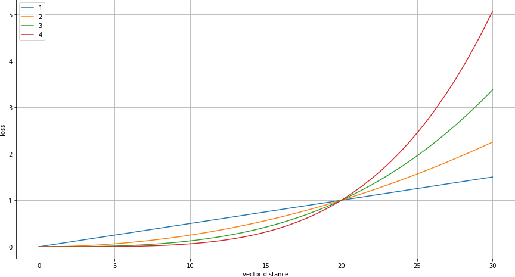

.. _dl_training:

Deep Learning - Training
========================

We are using **Keras** as the deep learning framework with **TensorFlow** as a backend. Additionally, we make an
assumption that the data has shape (320, 456) that corresponds to the 25 micron atlas.

Training data
-------------
To avoid wasting time on generating geometric augmentations on the fly we assume the user already precomputed them
and stored in an :code:`.h5` file. To see more details read :ref:`dl_data`.

.. _dl_training.supervised_generator:

SupervisedGenerator
~~~~~~~~~~~~~~~~~~~
The goal is to train the network via the :code:`fit_generator` method of a :code:`keras.Model`. In :code:`atlalign` one
can use the utility class :code:`atlalign.ml_utils.SupervisedGenerator`. The main parameter it expects in the constructor
is the path to the :code:`.h5` file. It needs to contain the following datasets

+---------------+---------------------------------------------+------------------+-----------+
|    **Name**   |               **Description**               |     **shape**    | **dtype** |
+---------------+---------------------------------------------+------------------+-----------+
|      img      | Grayscale moving image (0-255 intensities)  | (n, 320, 456)    | uint8     |
+---------------+---------------------------------------------+------------------+-----------+
|   deltas_xy   | Deltas for forward transformation (mov2reg) | (n, 320, 456, 2) | float16   |
+---------------+---------------------------------------------+------------------+-----------+
| inv_deltas_xy | Deltas for inverse transformation (reg2mov) | (n, 320, 456, 2) | float16   |
+---------------+---------------------------------------------+------------------+-----------+
|       p       | Coronal section in microns                  | (n,)             | int       |
+---------------+---------------------------------------------+------------------+-----------+
|    image_id   | Allen image section identifier              | (n,)             | int       |
+---------------+---------------------------------------------+------------------+-----------+
|   dataset_id  | Allen dataset identifier                    | (n,)             | int       |
+---------------+---------------------------------------------+------------------+-----------+

As additional parameters, one can specify

- :code:`batch_size` - batch size to train the network on
- :code:`shuffle` - if True, than dataset shuffled in the sample dimension at the end of each epoch
- :code:`augmenter_ref` - instance of :code:`imgaug.augmenters.Augmenter` representing intensity augmentations applied to the reference
- :code:`augmenter_mov` - instance of :code:`imgaug.augmenters.Augmenter` representing intensity augmentations applied to the moving
- :code:`return_inverse`- if :code:`True` then yielding also the inverser transformation

What does the :code:`SupervisedGenerator` yield? It is always 2 objects
If :code:`return_inverse=False` then:

1. :code:`X` - array of shape (:code:`batch_size`, 320, 456, 2) representing the reference and moving images
2. :code:`[reg_images, deltas_xy]`

    - :code:`reg_images` - array of shape (:code:`batch_size`, 320, 456, 1) representing registered images
    - :code:`deltas_xy` - array of shape (:code:`batch_size`, 320, 456, 2) representing x and y displacements

If :code:`return_inverse=True` then:

1. :code:`[X_rm, X_mr]`

    - :code:`X_rm` - array of shape (:code:`batch_size`, 320, 456, 2) representing the reference and moving images
    - :code:`X_mr` - array of shape (:code:`batch_size`, 320, 456, 2) representing the moving and reference images (swapped :code:`X_mr`)

2. :code:`[reg_images, deltas_xy, inv_deltas_xy]`

    - :code:`reg_images` - array of shape (:code:`batch_size`, 320, 456, 1) representing registered images
    - :code:`deltas_xy` - array of shape (:code:`batch_size`, 320, 456, 2) representing x and y displacements
    - :code:`inv_deltas_xy` - array of shape (:code:`batch_size`, 320, 456, 2) representing x and y displacements of the inverse mapping

.. code-block:: python

    from atlalign.ml_utils import SupervisedGenerator, augmenter_1

    path = '/path/to/file.h5'

    gen = SupervisedGenerator(path,
                              batch_size=32,
                              augmenter_mov=augmenter_1()
                              )

    gen_inv = SupervisedGenerator(path,
                                 batch_size=32,
                                augmenter_mov=augmenter_1(),
                                  return_inverse=True
                                 )

    len(gen[0]) == 2
    len(gen_inv[0]) == 2

Custom Layers
-------------
Before delving into the architectures let us first describe 3 custom layers (implemented in :code:`atlalign.ml_utils.layers`):

    - :code:`Affine2DVF` - Turns (2,3) affine matrix to a delta_x and delta_y (displacement field) with a fixed shape
    - :code:`BillinearInterpolation` - Differentiable version of :code:`warp` method of the :code:`DisplacementField`
    - :code:`DVFComposition` - Differentiable version of :code:`__call__` method of the :code:`DisplacementField`

Architecture
------------
Ideally, we want to have two networks that take care of global resp. local transformations. In other words the first
network makes sure that the moving and reference images are of the same scale, rotation and position. The second
network allows for a more fine-grained alignment of specific parts of the image.

Based on experiments we highly recommend training these two networks separately. When both of them are good enough
we can merge them into a single network.

Global
~~~~~~
The global network is conceptually identical to the Spatial Transformer Network - `STN
<https://arxiv.org/abs/1506.02025>`_. The goal is to have a regressor network that predicts a set of parameters
that fully define a transformation. The most common example (and also the one we implemented) is to find
parameters of an 2D affine transformation (6 parameters). Instead of using the actual ground truth matrix
we train the network on a different task - image registration.

We provide a utility function :code:`atlalign.nn.supervised_global_model_factory` that outputs :code:`keras.Model` that
corresponds to chosen hyperparamters. See below an example how to create a network that had the best performance
during our experiments.

.. code-block:: python

    from atlalign.nn import supervised_global_model_factory

    filters = (16, 16, 32, 32, 32)
    dense_layers = (40,)
    losses = ('perceptual_loss_net-lin_vgg', 'vector_distance')

    model_g = supervised_global_model_factory(filters=filters,
                                              dense_layers=dense_layers)

This is how the model looks like inside:

.. code-block:: bash

    Layer (type)                    Output Shape         Param #     Connected to
    ==================================================================================================
    input_1 (InputLayer)            (None, 320, 456, 2)  0
    __________________________________________________________________________________________________
    conv2d_1 (Conv2D)               (None, 320, 456, 16) 304         input_1[0][0]
    __________________________________________________________________________________________________
    conv2d_2 (Conv2D)               (None, 320, 456, 16) 2320        conv2d_1[0][0]
    __________________________________________________________________________________________________
    max_pooling2d_1 (MaxPooling2D)  (None, 160, 228, 16) 0           conv2d_2[0][0]
    __________________________________________________________________________________________________
    conv2d_3 (Conv2D)               (None, 160, 228, 16) 2320        max_pooling2d_1[0][0]
    __________________________________________________________________________________________________
    conv2d_4 (Conv2D)               (None, 160, 228, 16) 2320        conv2d_3[0][0]
    __________________________________________________________________________________________________
    max_pooling2d_2 (MaxPooling2D)  (None, 80, 114, 16)  0           conv2d_4[0][0]
    __________________________________________________________________________________________________
    conv2d_5 (Conv2D)               (None, 80, 114, 32)  4640        max_pooling2d_2[0][0]
    __________________________________________________________________________________________________
    conv2d_6 (Conv2D)               (None, 80, 114, 32)  9248        conv2d_5[0][0]
    __________________________________________________________________________________________________
    max_pooling2d_3 (MaxPooling2D)  (None, 40, 57, 32)   0           conv2d_6[0][0]
    __________________________________________________________________________________________________
    conv2d_7 (Conv2D)               (None, 40, 57, 32)   9248        max_pooling2d_3[0][0]
    __________________________________________________________________________________________________
    conv2d_8 (Conv2D)               (None, 40, 57, 32)   9248        conv2d_7[0][0]
    __________________________________________________________________________________________________
    max_pooling2d_4 (MaxPooling2D)  (None, 20, 28, 32)   0           conv2d_8[0][0]
    __________________________________________________________________________________________________
    conv2d_9 (Conv2D)               (None, 20, 28, 32)   9248        max_pooling2d_4[0][0]
    __________________________________________________________________________________________________
    conv2d_10 (Conv2D)              (None, 20, 28, 32)   9248        conv2d_9[0][0]
    __________________________________________________________________________________________________
    max_pooling2d_5 (MaxPooling2D)  (None, 10, 14, 32)   0           conv2d_10[0][0]
    __________________________________________________________________________________________________
    flatten_1 (Flatten)             (None, 4480)         0           max_pooling2d_5[0][0]
    __________________________________________________________________________________________________
    dense_1 (Dense)                 (None, 40)           179240      flatten_1[0][0]
    __________________________________________________________________________________________________
    dense_2 (Dense)                 (None, 6)            246         dense_1[0][0]
    __________________________________________________________________________________________________
    reshape_1 (Reshape)             (None, 2, 3)         0           dense_2[0][0]
    __________________________________________________________________________________________________
    extract_moving (Lambda)         (None, 320, 456, 1)  0           input_1[0][0]
    __________________________________________________________________________________________________
    affine2dvf_1 (Affine2DVF)       (None, 320, 456, 2)  0           reshape_1[0][0]
    __________________________________________________________________________________________________
    img_registered (BilinearInterpo (None, 320, 456, 1)  0           extract_moving[0][0]
                                                                     affine2dvf_1[0][0]
    ==================================================================================================
    Total params: 237,630
    Trainable params: 237,630
    Non-trainable params: 0

Note that one can create a custom network as long as the inputs and the outputs are compatible with the
:code:`SupervisedGenerator`.

Local
~~~~~
The most popular type of network to use for the local displacements is a UNet. Similarly to the global case,
we provide a convenience factory function :code:`atlalign.nn.supervised_model_factory` that outputs
an instance of :code:`keras.Model` given the selected hyperparameters.

See below an example with the best hyperparameters find during experiments.

.. code-block:: python

    import tensorflow as tf
    from atlalign.nn import supervised_model_factory

    start_filters = (16,)
    downsample_filters = (16, 32, 32, 32)
    middle_filters = (32,)
    upsample_filters = (32, 32, 32, 32)
    end_filters = (64, 64)

    compute_inv = True

    losses = ('perceptual_loss_net-lin_vgg', 'perceptual_loss_net-lin_vgg&vdclip2', 'perceptual_loss_net-lin_vgg')
    losses_weights = (1, 1, 1)

    model_l = supervised_model_factory(start_filters=start_filters,
                                       downsample_filters=downsample_filters,
                                       middle_filters=middle_filters,
                                       upsample_filters=upsample_filters,
                                       end_filters=end_filters,
                                       compute_inv=compute_inv,
                                       losses=losses,
                                       losses_weights=losses_weights)

.. code-block:: bash

    Layer (type)                    Output Shape         Param #     Connected to
    ==================================================================================================
    reg_mov (InputLayer)            (None, 320, 456, 2)  0
    __________________________________________________________________________________________________
    cropping2d_1 (Cropping2D)       (None, 320, 448, 2)  0           reg_mov[0][0]
    __________________________________________________________________________________________________
    conv2d_1 (Conv2D)               (None, 320, 448, 16) 304         cropping2d_1[0][0]
    __________________________________________________________________________________________________
    leaky_re_lu_1 (LeakyReLU)       (None, 320, 448, 16) 0           conv2d_1[0][0]
    __________________________________________________________________________________________________
    max_pooling2d_1 (MaxPooling2D)  (None, 160, 224, 16) 0           leaky_re_lu_1[0][0]
    __________________________________________________________________________________________________
    conv2d_2 (Conv2D)               (None, 160, 224, 16) 2320        max_pooling2d_1[0][0]
    __________________________________________________________________________________________________
    leaky_re_lu_2 (LeakyReLU)       (None, 160, 224, 16) 0           conv2d_2[0][0]
    __________________________________________________________________________________________________
    max_pooling2d_2 (MaxPooling2D)  (None, 80, 112, 16)  0           leaky_re_lu_2[0][0]
    __________________________________________________________________________________________________
    conv2d_3 (Conv2D)               (None, 80, 112, 32)  4640        max_pooling2d_2[0][0]
    __________________________________________________________________________________________________
    leaky_re_lu_3 (LeakyReLU)       (None, 80, 112, 32)  0           conv2d_3[0][0]
    __________________________________________________________________________________________________
    max_pooling2d_3 (MaxPooling2D)  (None, 40, 56, 32)   0           leaky_re_lu_3[0][0]
    __________________________________________________________________________________________________
    conv2d_4 (Conv2D)               (None, 40, 56, 32)   9248        max_pooling2d_3[0][0]
    __________________________________________________________________________________________________
    leaky_re_lu_4 (LeakyReLU)       (None, 40, 56, 32)   0           conv2d_4[0][0]
    __________________________________________________________________________________________________
    max_pooling2d_4 (MaxPooling2D)  (None, 20, 28, 32)   0           leaky_re_lu_4[0][0]
    __________________________________________________________________________________________________
    conv2d_5 (Conv2D)               (None, 20, 28, 32)   9248        max_pooling2d_4[0][0]
    __________________________________________________________________________________________________
    leaky_re_lu_5 (LeakyReLU)       (None, 20, 28, 32)   0           conv2d_5[0][0]
    __________________________________________________________________________________________________
    conv2d_6 (Conv2D)               (None, 20, 28, 32)   9248        leaky_re_lu_5[0][0]
    __________________________________________________________________________________________________
    leaky_re_lu_6 (LeakyReLU)       (None, 20, 28, 32)   0           conv2d_6[0][0]
    __________________________________________________________________________________________________
    up_sampling2d_1 (UpSampling2D)  (None, 40, 56, 32)   0           leaky_re_lu_6[0][0]
    __________________________________________________________________________________________________
    conv2d_7 (Conv2D)               (None, 40, 56, 32)   9248        up_sampling2d_1[0][0]
    __________________________________________________________________________________________________
    leaky_re_lu_7 (LeakyReLU)       (None, 40, 56, 32)   0           conv2d_7[0][0]
    __________________________________________________________________________________________________
    concatenate_1 (Concatenate)     (None, 40, 56, 64)   0           leaky_re_lu_7[0][0]
                                                                     leaky_re_lu_4[0][0]
    __________________________________________________________________________________________________
    conv2d_8 (Conv2D)               (None, 40, 56, 32)   18464       concatenate_1[0][0]
    __________________________________________________________________________________________________
    leaky_re_lu_8 (LeakyReLU)       (None, 40, 56, 32)   0           conv2d_8[0][0]
    __________________________________________________________________________________________________
    up_sampling2d_2 (UpSampling2D)  (None, 80, 112, 32)  0           leaky_re_lu_8[0][0]
    __________________________________________________________________________________________________
    conv2d_9 (Conv2D)               (None, 80, 112, 32)  9248        up_sampling2d_2[0][0]
    __________________________________________________________________________________________________
    leaky_re_lu_9 (LeakyReLU)       (None, 80, 112, 32)  0           conv2d_9[0][0]
    __________________________________________________________________________________________________
    concatenate_2 (Concatenate)     (None, 80, 112, 64)  0           leaky_re_lu_9[0][0]
                                                                     leaky_re_lu_3[0][0]
    __________________________________________________________________________________________________
    conv2d_10 (Conv2D)              (None, 80, 112, 32)  18464       concatenate_2[0][0]
    __________________________________________________________________________________________________
    leaky_re_lu_10 (LeakyReLU)      (None, 80, 112, 32)  0           conv2d_10[0][0]
    __________________________________________________________________________________________________
    up_sampling2d_3 (UpSampling2D)  (None, 160, 224, 32) 0           leaky_re_lu_10[0][0]
    __________________________________________________________________________________________________
    conv2d_11 (Conv2D)              (None, 160, 224, 32) 9248        up_sampling2d_3[0][0]
    __________________________________________________________________________________________________
    leaky_re_lu_11 (LeakyReLU)      (None, 160, 224, 32) 0           conv2d_11[0][0]
    __________________________________________________________________________________________________
    concatenate_3 (Concatenate)     (None, 160, 224, 48) 0           leaky_re_lu_11[0][0]
                                                                     leaky_re_lu_2[0][0]
    __________________________________________________________________________________________________
    conv2d_12 (Conv2D)              (None, 160, 224, 32) 13856       concatenate_3[0][0]
    __________________________________________________________________________________________________
    leaky_re_lu_12 (LeakyReLU)      (None, 160, 224, 32) 0           conv2d_12[0][0]
    __________________________________________________________________________________________________
    up_sampling2d_4 (UpSampling2D)  (None, 320, 448, 32) 0           leaky_re_lu_12[0][0]
    __________________________________________________________________________________________________
    conv2d_13 (Conv2D)              (None, 320, 448, 32) 9248        up_sampling2d_4[0][0]
    __________________________________________________________________________________________________
    leaky_re_lu_13 (LeakyReLU)      (None, 320, 448, 32) 0           conv2d_13[0][0]
    __________________________________________________________________________________________________
    concatenate_4 (Concatenate)     (None, 320, 448, 48) 0           leaky_re_lu_13[0][0]
                                                                     leaky_re_lu_1[0][0]
    __________________________________________________________________________________________________
    conv2d_14 (Conv2D)              (None, 320, 448, 32) 13856       concatenate_4[0][0]
    __________________________________________________________________________________________________
    leaky_re_lu_14 (LeakyReLU)      (None, 320, 448, 32) 0           conv2d_14[0][0]
    __________________________________________________________________________________________________
    conv2d_15 (Conv2D)              (None, 320, 448, 64) 18496       leaky_re_lu_14[0][0]
    __________________________________________________________________________________________________
    leaky_re_lu_15 (LeakyReLU)      (None, 320, 448, 64) 0           conv2d_15[0][0]
    __________________________________________________________________________________________________
    conv2d_16 (Conv2D)              (None, 320, 448, 64) 36928       leaky_re_lu_15[0][0]
    __________________________________________________________________________________________________
    leaky_re_lu_16 (LeakyReLU)      (None, 320, 448, 64) 0           conv2d_16[0][0]
    __________________________________________________________________________________________________
    conv2d_17 (Conv2D)              (None, 320, 448, 2)  514         leaky_re_lu_16[0][0]
    __________________________________________________________________________________________________
    mov_reg (InputLayer)            (None, 320, 456, 2)  0
    __________________________________________________________________________________________________
    extract_moving (Lambda)         (None, 320, 456, 1)  0           reg_mov[0][0]
    __________________________________________________________________________________________________
    dvf (ZeroPadding2D)             (None, 320, 456, 2)  0           conv2d_17[0][0]
    __________________________________________________________________________________________________
    model_1 (Model)                 (None, 320, 456, 2)  192578      mov_reg[0][0]
    __________________________________________________________________________________________________
    img_registered (BilinearInterpo (None, 320, 456, 1)  0           extract_moving[0][0]
                                                                     dvf[0][0]
    __________________________________________________________________________________________________
    inv_dvf (Lambda)                (None, 320, 456, 2)  0           model_1[1][0]
    ==================================================================================================
    Total params: 192,578
    Trainable params: 192,578
    Non-trainable params: 0

One important thing to note is the boolean :code:`compute_inv`. When equal to :code:`True` then the network
not only learns to warp the moving image such that it is as similar to the reference as possible but also
vice versa. In other words, it also learns to warp the reference image such that it is as similar to the moving
image as possible. Since our generator :code:`SupervisedGenerator` can yield also inverse displacement fields
this is trivially done just via sharing weights and swapping the order of the inputs.

Loss function
-------------
Loss function together with the architecture is the most important component. We experimented with many different
losses and ideas and found that losses that are based on the **Perceputal Loss** are superior in vast majority of cases.
See `The Unreasonable Effectiveness of Deep Features as a Perceptual Metric <https://arxiv.org/abs/1801.03924>`_ for
more details.

The user can access the losses via two dictionaries:

- :code:`atlalign.ml_utils.ALL_IMAGE_LOSSES` - Losses on images (grayscale)
- :code:`atlalign.ml_utils.ALL_DVF_LOSSES` - Losses on displacement fields

One important insight is that we can also apply image losses on displacement fields since displacements fields
are nothing else than 2 images - :code:`delta_x` and :code:`delta_y`. This is implemented in
:code:`atlalign.ml_utils.losses.DVF2IMG`. Note that we also scale down the displacement by a constant.

.. testcode::

    from atlalign.ml_utils import ALL_DVF_LOSSES, ALL_IMAGE_LOSSES

    set(ALL_IMAGE_LOSSES.keys()).issubset(set(ALL_DVF_LOSSES.keys()))

In what follows we describe some interesting and useful losses. They are all implemented in :code:`atlalign.ml_utils.losses`.

Perceptual loss
~~~~~~~~~~~~~~~
Image loss that has four versions

- :code:`perceptual_loss_net-lin_alex`
- :code:`perceptual_loss_net-lin_vgg`
- :code:`perceptual_loss_net_alex`
- :code:`perceptual_loss_net_vgg`

If the string :code:`lin` is contained then it refers to a model where linear layer inserted after the feature extractor.
The second string refers to the CNN used to extract features.

Vector distance and its clipped version
~~~~~~~~~~~~~~~~~~~~~~~~~~~~~~~~~~~~~~~
Displacement field loss that represents the average euclidean distance between the prediction and the ground truth.
The average is taken over all pixels and all samples in the batch.

Note that instead of using the vector distance as the main loss one might just use it as a simple way how
to prevent the network from resorting to some exit strategies. We call this a clipper vector distance.

In the below figure on can see the idea behind clipping. The user specifies a threshold (20) and a power
and the actual loss is then computed as :code:`loss = (vd / threshold) ** power`.

See below the official keys of :code:`atlalign.ml_utils.ALL_DVF_LOSSES` but not that one can easily add other versions
via :code:`atlalign.ml_utils.losses.VDClipper`.

- :code:`vector_distance`
- :code:`vdclip2` - :code:`threshold=20`, :code:`power=2`
- :code:`vdclip3` - :code:`threshold=20`, :code:`power=3`

The idea behind having :code:`power > 1` is to punish the model for making big mistakes but be more forgiving on smaller ones.

Mixer
~~~~~
Mixer is a meta loss that simply takes two losses and computes their convex combination (by default just a mean). The
corresponding keys in :code:`atlalign.ml_utils.ALL_DVF_LOSSES` have the form of :code:`first&second`.

Saving model
------------
After training one can easily save the model with a utility function :code:`atlalign.ml_utils.save_model`. The first
argument represents the actual :code:`keras.Model` instance and the second is the path (without extensions).
The keyword argument :code:`separate` allows the user to select whether to save weights and architecture separately
or not. If done separately one loses the information on the loss function and the optimizer (and its state).