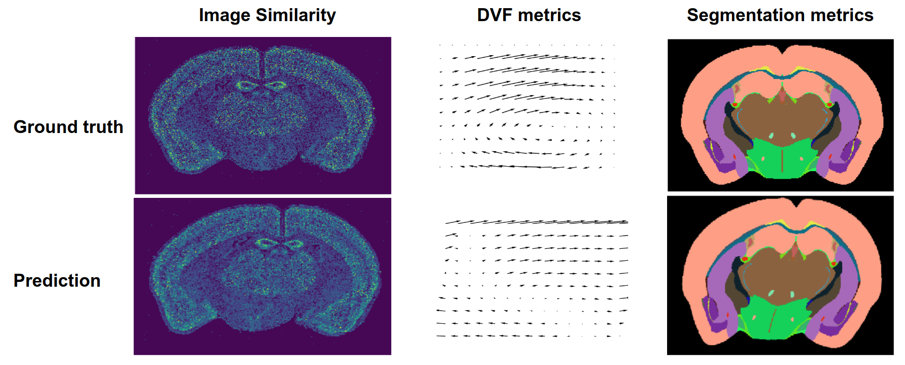

Metrics and Evaluation
======================
Assuming we have the ground truth labels (necessary for supervised learning) we can use multiple evaluation metrics.
In general they can be grouped into 3 categories based on what they compare:

- **Image similarity**
- **Displacement field**
- **Segmentation**

All these metrics are implemented in :code:`atlalign.metrics`. A subset of them is also available as drop-in
losses for deep learning in :code:`atlalign.ml_utils.losses`.

The following sub-sections list the available metrics in each of the three categories.
They are all part of the ``atlalign.metrics`` module and have a common interface::

    atlalign.metrics.<metric_name>(y_true, y_pred, **kwargs)

The parameters ``y_true`` and ``y_pred`` are pairs of images, displacement fields,
or segmentation maps. Multiple pairs of images can be processed at once by stacking
them along the first dimension, so that ``y_true`` and ``y_pred`` have the shape
``(n_images, ...)``.

Some metrics have optional keyword arguments that differ from metric to metric,
the API reference for more details.

Image Similarity Metrics
------------------------

Loss-like (the smaller the better):

- ``mse_img`` -- mean squared error
- ``mae_img`` -- mean absolute error
- ``demons_img`` -- ANTsPy's demons metric
- ``perceptual_loss_img`` -- perceptual loss

Similarity-like (the higher the better):

- ``psnr_img`` -- peak signal to noise ratio (max = infinity)
- ``cross_correlation_img`` -- image cross correlation (max = 1)
- ``ssmi_img`` -- structural similarity (max = 1)
- ``mi_img`` -- mutual information (max = mutual information with itself)

Displacement Field Metrics
--------------------------

- ``correlation_combined`` -- combined version of correlation
- ``mae_combined`` -- combined version of mean absolute error
- ``mse_combined`` -- combined version of mean squared error
- ``r2_combined`` -- combined version of r2
- ``vector_distance_combined`` -- combined version of vector distance

Segmentation Metrics
--------------------

- ``iou_score`` -- intersection over union (between 0 and 1, the higher the better)
- ``dice_score`` -- dice score (between 0 and 1, the higher the better)

Compute Many Metrics at Once
----------------------------

To get a comprehensive overview of how specific model performs, we implemented a utility function
:code:`atlalign.metrics.evaluate` that computes multiple metrics at the same time and returns the results
in a :code:`pandas.DataFrame`.

.. code-block:: python

    import numpy as np

    from atlalign.metrics import evaluate

    n_samples = 5
    shape = (320, 456)

    y_true = np.random.randint(0, 20, size=(n_samples, *shape, 2))
    y_pred = np.random.randint(0, 20, size=(n_samples, *shape, 2))

    imgs_mov = np.random.random((n_samples, *shape))
    img_ids = np.array(range(n_samples))
    dataset_ids = np.array(range(n_samples))
    ps = np.linspace(0, 12200, num=n_samples).astype('int')

    _, res_df = evaluate(y_true,
                         y_pred,
                         imgs_mov=imgs_mov,
                         img_ids=img_ids,
                         ps=ps,
                         dataset_ids=dataset_ids,
                         depths=(1, 2, 3, 4, 5))

    print(res_df.columns)

.. code-block:: python

    Index(['angular_error_a', 'cross_correlation_img_a', 'dataset_id',
           'iou_depth_1', 'iou_depth_2', 'iou_depth_3', 'iou_depth_4',
           'iou_depth_5', 'jacobian_nonpositive_pixels_a',
           'jacobian_nonpositive_pixels_perc_a', 'mae_img_a', 'mi_img_a',
           'mse_img_a', 'norm_a', 'p', 'psnr_img_a', 'ssmi_img_a',
           'vector_distance_a'],
          dtype='object')
