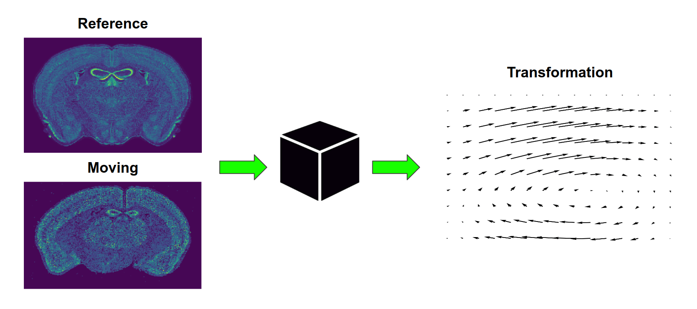
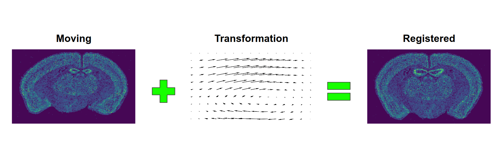

Image Registration 101
======================
Image registration is a task of geometrically transforming one image (moving) to a domain of another image (reference).
This problem can be seen as two separate steps.

**1) Prediction of a geometric transformation**

**2) Warping the moving image with the transformation**

There are multiple different algorithms that achieve the first step. This project focuses on supervised **deep learning**
methods however also provides easy interface to other approaches - **feature** and **intensity** based registration.