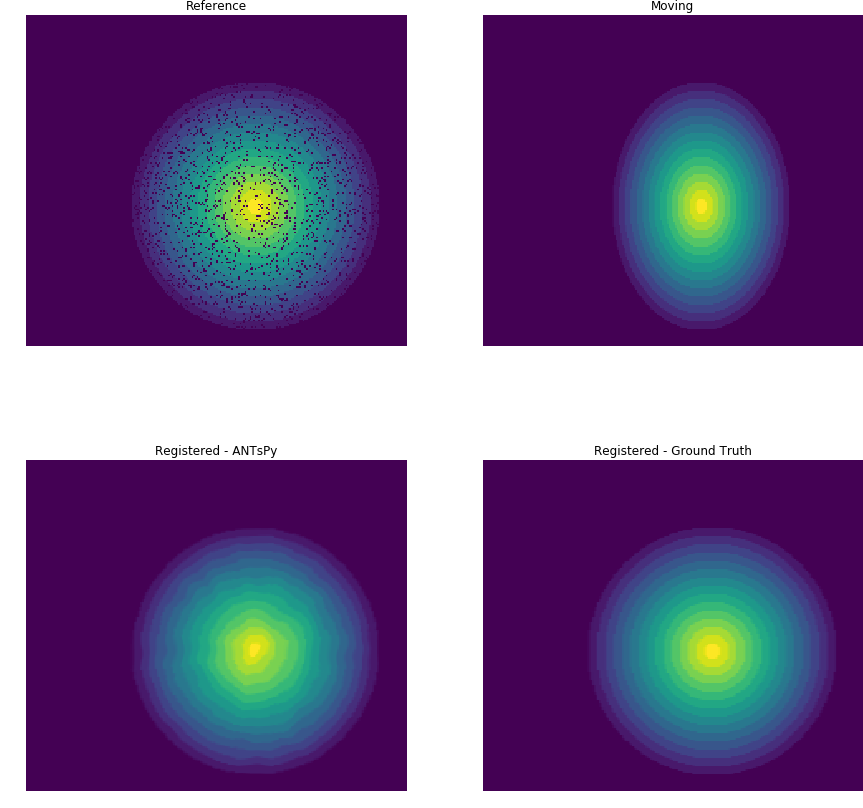

Intensity Based Registration
============================
Intensity based registration refers to a set of algorithms that try to solve the registration problem via per sample
maximization of an image similarity metric.

ANTsPy
------
We provide a very simple interface to an existing registration package caled **ANTsPy**. To find out more about
the original package we refer the reader to

- `github <https://github.com/ANTsX/ANTsPy>`_
- `docs <https://antspyx.readthedocs.io>`_

To use **ANTsPy** within :code:`atlalign` one can simply use :code:`atlalign.non_ml.antspy_registration`. See below
a minimal example.

.. code-block:: python

    import matplotlib.pyplot as plt
    import numpy as np

    from atlalign.base import DisplacementField
    from atlalign.data import circles
    from atlalign.non_ml import antspy_registration

    random_state = 4
    shape =  (200, 230)
    p_drop_pixel = 0.1

    df = DisplacementField.generate(shape, approach='affine_simple', scale_x=1.4)

    img_ref = circles(1, shape, radius=75, n_levels=15, random_state=random_state)[0,..., 0]
    img_mov = df.warp(img_ref)

    to_drop = np.random.choice((True, False), p=(p_drop_pixel, 1 - p_drop_pixel), size=shape)
    img_ref[to_drop] = 0

    df_mov2ref_anstpy, _ = antspy_registration(img_ref, img_mov)
    df_mov2ref_truth = df.pseudo_inverse()

    img_reg_antspy = df_mov2ref_anstpy.warp(img_mov)
    img_reg_truth = df_mov2ref_truth.warp(img_mov)

    fig, ((ax_ref, ax_mov), (ax_reg_antspy, ax_reg_truth)) = plt.subplots(2, 2, figsize=(15, 15))
    ax_ref.imshow(img_ref)
    ax_ref.set_axis_off()
    ax_ref.set_title('Reference')

    ax_mov.imshow(img_mov)
    ax_mov.set_axis_off()
    ax_mov.set_title('Moving')

    ax_reg_antspy.imshow(img_reg_antspy)
    ax_reg_antspy.set_axis_off()
    ax_reg_antspy.set_title('Registered - ANTsPy')

    ax_reg_truth.imshow(img_reg_truth)
    ax_reg_truth.set_axis_off()
    ax_reg_truth.set_title('Registered - Ground Truth')

