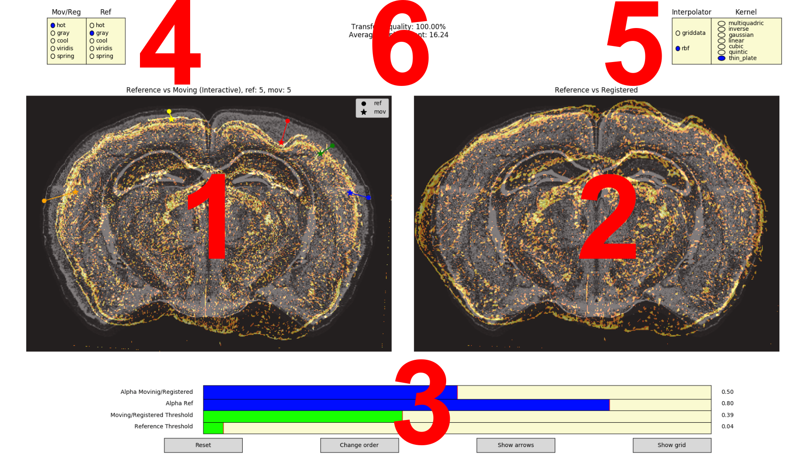

Labeling tool
=============
The goal of the labeling tool is to allow the user to align manually any two images and extract
the displacement field.

Launching
---------
To launch the labeling tool one needs to use the entry point ``label-tool``.

.. code-block:: bash

    label-tool --help
    usage: label-tool [-h] [-s] ref mov output_path

    positional arguments:
      ref          Either a path to a reference image or a number from [0, 528)
                   representing the coronal dimension in the nissl stain volume.
      mov          Path to a moving image. Needs to be of the same shape as
                   reference.
      output_path  Folder where the outputs will be stored.

    optional arguments:
      -h, --help   show this help message and exit
      -s, --swap   Swap to the moving to reference mode. (default: False)

Arguments
~~~~~~~~~

1. ``ref`` - number from 0 - 527 representing coronal section or a path to a custom reference image
2. ``mov`` - path to the moving image that needs to have the same shape as the reference one
3. ``output_path`` - path to folder where output is saved

Options
~~~~~~~

- ``--swap`` - flag that if activated the first landmark of a pair is on moving image otherwise it
  is on the reference
- ``--force-grayscale`` - force color images to be converted to grayscale, can be useful for taking
  advantage of the colormap selection which does not work for color images.

Interface
---------

The user adds landmark points until they are fully happy with the registration. Once the GUI is
closed the resulting displacement field, the registered and moving images, the key points, and other
metadata are stored into the :code:`OUTPUT_PATH`.

1
~
The **interactive window** where the user specifies pairs of points that represent the landmarks in
the moving (resp. reference) image. The landmarks in the moving image are represented by **crosses**
and the ones in the reference image by **circles**. To delete a point hover your mouse over a
reference point and press "d".

2
~
The **result window** that displays the current registered image and the reference. Note that one
can also see the deformation of a regular grid if one clicks on the **Show grid** button.

3
~
**Sliders**

- **Alpha Moving/Registered** - Controls the blending together of the reference and moving images.
  Value 0 corresponds to only the reference image, value 1 to only the moving image. The slider
  remembers two different settings that can be toggled using the space bar. This can be useful for
  quickly getting the full view of one of the images.
- **Alpha Ref** - Control the translucency of the reference image.
- **Moving/Registered Threshold** - Remove pixels below a given intensity from the moving image.
- **Reference Threshold** - Remove pixels below a given intensity from the reference image.

**Buttons**

- **Reset** - Deletes all registration points.
- **Symmetric Registration** - Toggle symmetry registration where all keypoints are automatically
  mirrored in the left/right direction.
- **Change Order** - Swap the moving and reference image order.
- **Show Arrows** - Toggle the visibility of lines between keypoints.
- **Show Grid** - Show regular grid warped by the current displacement. Red spots represent regions
  that are not invertible.

4
~
**Color maps** for the reference and moving image.

5
~
**Overview statistics**

- **Transformation quality** - If lower than 100% then displacement contains folds. Check the grid
  to see where exactly.
- **Average displacement** - Average displacement size

**Keyboard shortcuts**

- **"a"** - pan
- **"s"** - zoom
- **"d"** - delete a keypoint
- **"f"** - reset zoom
- **space** - toggle the reference/moving blending alpha value

Note that after zooming/panning the respective shortcut key needs to be pressed again to get back
to the keypoint addition mode.

6
~
**Interpolation window**. The first column represents the general algorithm

- **griddata** - Delaunay triangulation followed by affine interpolation for each triangle
- **rbf** - Interpolation using basis function

The second column is only used for the **rbf** interpolation and it specifies the kernel.

FAQ
---

- **Can the moving and reference image have different sizes?** No, make sure they are the same and
  one can resize the displacement field after registration
- **How do I save the displacement?** Simply by closing the GUI
- **Can I delete some landmark pairs?** Yes, point at the reference landmark and press space bar
